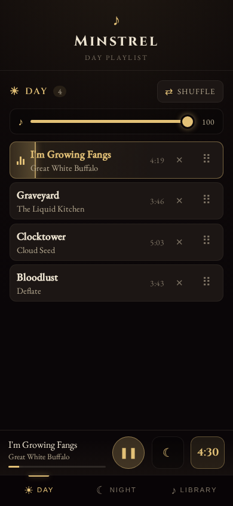

# Minstrel

**Minstrel** is a music player for the Storyteller running in-person games of the social deduction game *Blood on the Clocktower*.

It plays atmospheric music for your sessions, switches automatically between separate day and night playlists, and provides an integrated countdown timer to mark the end of each day.

Minstrel comes in two variants: **Desktop** plays through a laptop wired to real speakers with your phone as the remote, and **Mobile** runs a whole game off your phone alone — open [phoenox.github.io/Minstrel](https://phoenox.github.io/Minstrel/) to install it, and it works fully offline from then on.

  
  
  

## Features

* **Two playlists, one game** — keep separate playlists for the Day and Night phases and switch between them with a single tap. Songs fade out and fade in smoothly so the transition never feels abrupt.
* **Day timer** — start a countdown for any number of minutes. When it expires, a gong sounds to tell the table that the day is over.
* **Song library** — browse all your music (the folder Minstrel scans on Desktop, the songs you import on Mobile), search by artist, title, or album, and add songs to either playlist with one tap.
* **Independent volume per playlist** — set a different volume for the day and night playlists so quiet ambient tracks and louder pieces sit at the right level.

## Two ways to run Minstrel

* **[Desktop](#desktop-setup)** — a laptop or TV-connected machine plays the music through proper speakers, and your phone becomes the remote control over local Wi-Fi. The best sound for the table.
* **[Mobile](#mobile-setup)** — everything runs on one phone. Installed once, it works fully offline: import your music and run a whole game with no laptop and no Wi-Fi.

Both variants share the same playlists, library, timer, and controls — pick whichever fits the evening, and skip to [Building your playlists](#building-your-playlists) once you are set up.

## Desktop setup

### 1. Get the app

Download the version of Minstrel for your operating system from the [GitHub Releases page](https://github.com/Phoenox/Minstrel/releases) and extract it to a folder.

### 2. Add your music

Point the app to your music by editing `appsettings.json`: set `Music` → `Directory` to your music folder.

Minstrel supports common formats such as MP3, FLAC, OGG, and M4A. Subfolders are fine.

### 3. Start the app

Double-click the Minstrel file. A console window opens, and your default web browser opens automatically with the **Player** screen.

### 4. Open the Player

The Player opens to an entry screen with an **Enter the town** button. Click it once to begin — browsers only allow sound after a click, so this first tap is what lets Minstrel play audio. After that the Player shows the scene and plays whatever the Remote tells it to.

Run the Player on the device connected to your speakers, and leave it open for the whole session.

### 5. Connect your phone

A QR code sits on the Player screen. Scan it with your phone's camera to open the **Remote**. If you would rather type it, the pairing address is printed under the code.

Use **Hide code** on the Player to tuck the QR away once everyone is connected, and **Pair remote** to bring it back for a latecomer.

**Important:** Your phone must be on the same Wi-Fi network as the device running Minstrel.

## Mobile setup

### 1. Open Minstrel on your phone

Go to [phoenox.github.io/Minstrel](https://phoenox.github.io/Minstrel/) in your phone's browser.

### 2. Install it to your home screen

* **iOS:** open the link in Safari, tap **Share**, then **Add to Home Screen**.
* **Android:** open the link in Chrome, tap the **⋮ menu**, then **Install app**.

Once installed, Minstrel works fully offline — no connection needed at the table.

### 3. Import your music

Open the **Library** tab and tap **Import a folder** to bring in your music folder, or **Import individual files** to pick songs one by one. Minstrel supports common formats such as MP3, FLAC, OGG, and M4A.

Phones sometimes reclaim storage from sites they haven't used in a while. If songs ever show as missing, re-import the same files — they reconnect automatically.

## Building your playlists

The controls are the same in both variants — on Desktop they live on the Remote, on Mobile on the phone itself. Three tabs sit along the bottom: **Day**, **Night**, and **Library**.

* Open the **Library** tab to see all your music. Tap the sun icon to add a song to the day playlist or the moon icon to add it to the night playlist. The search box filters by artist, title, or album.
* Open the **Day** or **Night** tab to see that playlist. Drag songs by the handle on the right to reorder them, tap the **×** to remove one, and use **Shuffle** at the top to randomise the order.
* Each playlist tab has its own volume slider at the top, so you can balance day and night audio independently.

Your playlists and volumes are saved automatically.

## Running a game

1. Tap the **play** button (the square on the left of the bottom bar) to start the current playlist (on Desktop, the sound comes from the Player device).
2. When the day ends, tap the big **Switch to Night** button. The current song fades out and a song from the night playlist fades in. Tap **Switch to Day** to come back for the next round.
3. To start the day timer, tap the **timer** button on the right of the bottom bar, set the number of minutes with **−** / **+**, and tap **Start timer**. The timer button shows the time left (on Desktop, the Player also counts it down over the scene), and a gong plays when it reaches zero. Tap the timer button again to stop it early.

## Acknowledgements and Copyrights

* [Blood on the Clocktower](https://bloodontheclocktower.com/) is a trademark of Steven Medway and [The Pandemonium Institute](https://www.thepandemoniuminstitute.com/)
* The demo songs can be found on [Jamendo](https://jamendo.com/start):
  * [Clocktower](https://www.jamendo.com/track/1206097/clocktower) by [Cloud Seed](https://www.jamendo.com/artist/463887/cloud-seed)
  * [Bloodlust](https://www.jamendo.com/track/786901/bloodlust) by [Deflate](https://www.jamendo.com/artist/369102/deflate)
  * [Graveyard](https://www.jamendo.com/track/1623977/graveyard) by [The Liquid Kitchen](https://www.jamendo.com/artist/515695/the-liquid-kitchen)
  * [I'm Growing Fangs](https://www.jamendo.com/track/1198383/i-m-growing-fangs) by [Great White Buffalo](https://www.jamendo.com/artist/433617/great-white-buffalo)
* The demo wallpaper has been generated using AI.
